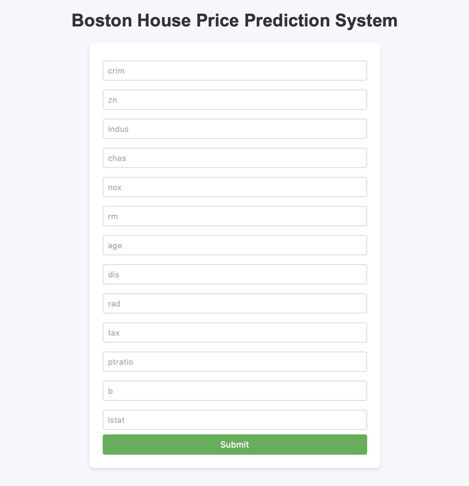

# Table of Contents

- [About The Project](#about-the-project)
- [About the Data](#about-the-data)
  - [Target Variable](#target-variable)
  - [Dataset Source Link](#dataset-source-link)
- [Technology Stack](#technology-stack)
- [Getting Started](#getting-started)
- [Installation Steps](#installation-steps)
  - [Option 1: Installation from GitHub](#option-1-installation-from-github)
  - [Option 2: Installation from DockerHub](#option-2-installation-from-dockerhub)
- [Setup](#setup)
  - [MLflow Tracking](#mlflow-tracking)
- [Usage and Configuration](#usage-and-configuration)
- [Contributing](#contributing)
- [License](#license)
- [Contact](#contact)
- [Acknowledgements](#acknowledgements)

## About The Project

This project aims to develop a machine learning model that accurately predicts housing prices using the Boston Housing dataset. By analyzing various features of houses, such as crime rate, number of rooms, and accessibility to highways, the model provides valuable insights for potential buyers or sellers in estimating housing prices. The project utilizes the powerful CatBoostRegressor algorithm for optimal performance and incorporates techniques like data preprocessing, exploratory data analysis, and model training. The trained model can be used as a tool to make informed decisions in the real estate market.



## About the Data

1. CRIM: Per capita crime rate by town
2. ZN: Proportion of residential land zoned for lots over 25,000 sq. ft.
3. INDUS: Proportion of non-retail business acres per town
4. CHAS: Charles River dummy variable (1 if tract bounds river; 0 otherwise)
5. NOX: Nitric oxide concentration (parts per 10 million)
6. RM: Average number of rooms per dwelling
7. AGE: Proportion of owner-occupied units built prior to 1940
8. DIS: Weighted distances to five Boston employment centers
9. RAD: Index of accessibility to radial highways
10. TAX: Full-value property tax rate per $10,000
11. PTRATIO: Pupil-teacher ratio by town
12. B: 1000(Bk - 0.63)^2 where Bk is the proportion of blacks by town
13. LSTAT: Percentage of lower status of the population

### Target Variable

- MEDV: Median value of owner-occupied homes in $1000s

### Dataset Source Link

Dataset Url : `https://github.com/selva86/datasets/blob/master/BostonHousing.csv`

## Technology Stack

- Pandas
- Numpy
- Scikit-learn
- Flask
- DVC
- MLFlow
- Seaborn
- Matplotlib

## Getting Started

This will help you understand how you may give instructions on setting up your project locally.
To get a local copy up and running follow these simple example steps.

## Installation Steps

### Option 1: Installation from GitHub

Follow these steps to install and set up the project directly from the GitHub repository:

1. **Clone the Repository**

   - Open your terminal or command prompt.
   - Navigate to the directory where you want to install the project.
   - Run the following command to clone the GitHub repository:
     ```
     git clone https://github.com/shubhamprajapati7748/End-to-End-House-Price-Prediction
     ```

2. **Create a Virtual Environment** (Optional but recommended)

   - It's a good practice to create a virtual environment to manage project dependencies. Run the following command:
     ```
     conda create -p <Environment_Name> python==<python version> -y
     ```

3. **Activate the Virtual Environment** (Optional)

   - Activate the virtual environment based on your operating system:
     ```
     conda activate <Environment_Name>/
     ```

4. **Install Dependencies**

   - Navigate to the project directory:
     ```
     cd [project_directory]
     ```
   - Run the following command to install project dependencies:
     ```
     pip install -r requirements.txt
     ```

5. **Run the Project**

   - Start the project by running the appropriate command.
     ```
     python app.py
     ```

6. **Access the Project**
   - Open a web browser or the appropriate client to access the project.

<br><br>

### Option 2: Installation from DockerHub

If you prefer to use Docker, you can install and run the project using a Docker container from DockerHub:

1. **Pull the Docker Image**

   - Open your terminal or command prompt.
   - Run the following command to pull the Docker image from DockerHub:
     ```
     docker pull shubhamprajapati7748/house-app
     ```

2. **Run the Docker Container**

   - Start the Docker container by running the following command, and mapping any necessary ports:
     ```
     docker run -p 5000:5000 shubhamprajapati7748/house-app
     ```

3. **Access the Project**
   - Open a web browser or the appropriate client to access the project.

## Setup

### MLflow Tracking

We use MLflow to log and track our machine learning experiments. The MLFLOW_TRACKING_URI environment variable is set to the DagsHub repository's MLflow tracking URI.

```bash
export MLFLOW_TRACKING_URI=<MLFLOW_TRACKING_URI>

export MLFLOW_TRACKING_USERNAME=<MLFLOW_TRACKING_USERNAME>

export MLFLOW_TRACKING_PASSWORD=<MLFLOW_TRACKING_PASSWORD>
```

## Usage and Configuration

This project requires Amazon Web Services Access Key ID and Secret Access Key for interacting with AWS services. Follow these steps to configure your project to use AWS keys:

1. **Obtain Your AWS Access Key ID and Secret Access Key**:

   - Log in to the AWS Management Console.
   - Open the IAM (Identity and Access Management) dashboard.
   - Create a new IAM user or use an existing one.
   - Attach the necessary policies to the user.
   - Generate an access key for the user. Save these keys securely.

2. **Configuration**:
   - Store your AWS Access Key ID and Secret Access Key securely. Do not hardcode them directly in your code or expose them in public repositories. Instead, use environment variables or a configuration file to manage them securely.

## Contributing

Contributions are what make the open source community such an amazing place to learn, inspire, and create. Any contributions you make are **greatly appreciated**.

If you have a suggestion that would make this better, please fork the repo and create a pull request. You can also simply open an issue with the tag "enhancement".
Don't forget to give the project a star! Thanks again!

1. Fork the Project
2. Create your Feature Branch
3. Commit your Changes
4. Push to the Branch
5. Open a Pull Request

## License

Distributed under the MIT License. See `LICENSE.txt` for more information.

## Contact

Shubham Prajapati - [@shubhamprajapati7748@gmail.com](shubhamprajapati7748@gmail.com)

## Acknowledgements

We'd like to extend our gratitude to all individuals and organizations who have played a role in the development and success of this project. Your support, whether through contributions, inspiration, or encouragement, has been invaluable. Thank you for being a part of our journey.
